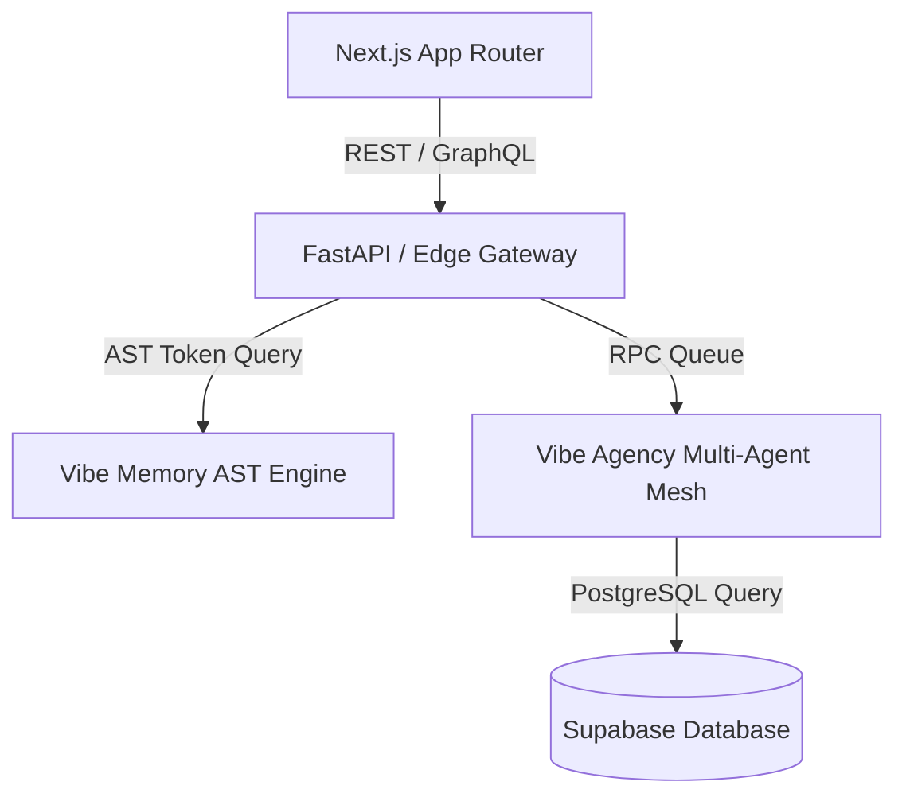

# 📊 Canvas & Architecture Visualizer Skill

> **Purpose**: Generate clear, publication-ready Mermaid diagrams, system flowcharts, and sequence maps that illustrate complex multi-agent and full-stack software architectures.

---

## 📐 Supported Visual Formats

### 1. System Architecture Flow (Mermaid Graph)

### 2. State Machine Transitions
* Visualizes active, idle, error, and recovery states with clear directional arrows and event labels.
